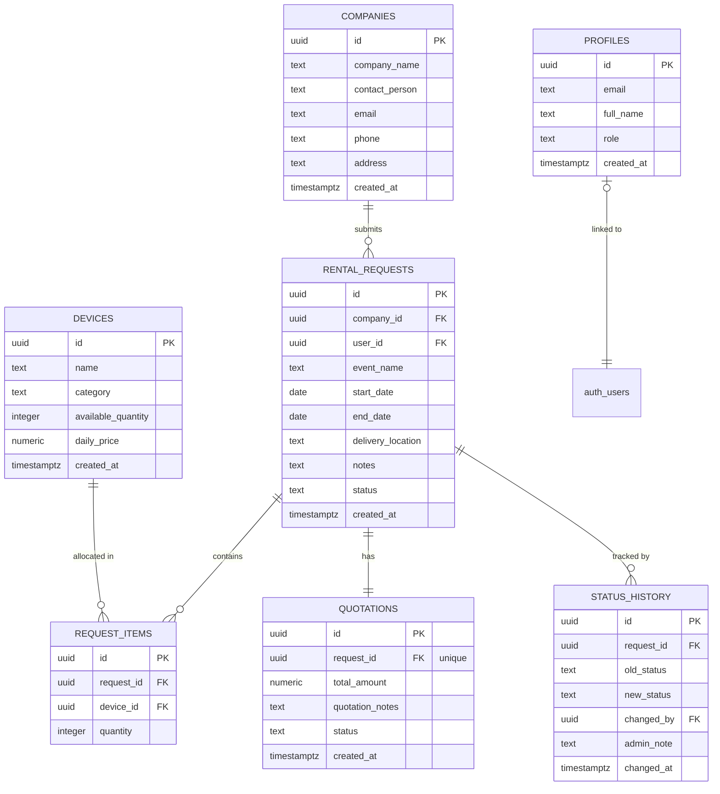

# Database Schema & ER Diagram Design
**Project**: Corporate Bulk Rental Portal  
**Role**: Student 3 – Testing & Deployment  
**Author**: V. Sasidhar Reddy  
**Date**: June 18, 2026

---

## 1. Overview
The Corporate Bulk Rental Portal database is built on PostgreSQL (hosted via Supabase). The schema represents a B2B electronics booking ledger tracking customers, hardware devices, bulk orders, items, pricing quotations, and status history changes.

---

## 2. Entity Relationship (ER) Diagram

---

## 3. Database Table Definitions

### 3.1. `profiles`
* **Purpose**: Extends Supabase `auth.users` table with application-specific metadata.
* **Fields**:
  * `id` (UUID, PK, References `auth.users`): The user primary auth ID.
  * `email` (Text): User registration email.
  * `full_name` (Text): Display name.
  * `role` (Text, Check: `'admin'`, `'client'`): System privilege level.

### 3.2. `companies`
* **Purpose**: Stores the business contact profiles for B2B corporate customers.
* **Fields**:
  * `id` (UUID, PK): Unique company record ID.
  * `company_name` (Text): Legal organization name.
  * `contact_person` (Text): Account representative name.
  * `email` / `phone` (Text): Direct contacts.
  * `address` (Text): Billing/Shipping headquarters.

### 3.3. `devices` (Inventory)
* **Purpose**: Catalog of rental hardware types, inventory count, and baseline rates.
* **Fields**:
  * `id` (UUID, PK): Hardware identifier.
  * `name` (Text): E.g. 'Dell Latitude 5520'.
  * `category` (Text, Check: `'Laptop'`, `'Desktop'`, `'Monitor'`, `'Projector'`, `'Printer'`): Asset class.
  * `available_quantity` (Integer): Currently stock units count.
  * `daily_price` (Numeric): Base rate per calendar day.

### 3.4. `rental_requests`
* **Purpose**: Primary ledger record for bulk rental bookings.
* **Fields**:
  * `id` (UUID, PK): Order identifier.
  * `company_id` (UUID, FK): References `companies.id`.
  * `user_id` (UUID, FK): Owner references `auth.users.id`.
  * `event_name` (Text): Description of the client event.
  * `start_date` / `end_date` (Date): Rental period range.
  * `delivery_location` (Text): Shipping address.
  * `status` (Text, Check: `'Pending'`, `'Under Review'`, `'Quoted'`, `'Approved'`, `'Allocated'`, `'Delivered'`, `'Completed'`, `'Rejected'`): Workflow lifecycle state.

### 3.5. `request_items`
* **Purpose**: Association table itemizing device quantities requested.
* **Fields**:
  * `id` (UUID, PK): Item identifier.
  * `request_id` (UUID, FK): References `rental_requests.id`.
  * `device_id` (UUID, FK): References `devices.id`.
  * `quantity` (Integer): Units requested.

### 3.6. `quotations`
* **Purpose**: Captures generated price proposals and notes sent to the client.
* **Fields**:
  * `id` (UUID, PK): Quotation ID.
  * `request_id` (UUID, FK, Unique): Linked rental request.
  * `total_amount` (Numeric): Sum calculations of hardware packages.
  * `status` (Text, Check: `'Draft'`, `'Sent'`, `'Approved'`, `'Rejected'`): Quotation approval status.

### 3.7. `status_history`
* **Purpose**: Audit trails tracking every status transition of a request.
* **Fields**:
  * `id` (UUID, PK): History entry ID.
  * `request_id` (UUID, FK): Linked request.
  * `old_status` / `new_status` (Text): Status shift delta.
  * `changed_by` (UUID, FK): Administrator account ID.
  * `admin_note` (Text): Rationale for state change.

---

## 4. Row Level Security (RLS) Overview
* **General Visibility**: Everyone can view hardware items (`devices`). Only administrators can insert, update, or delete devices.
* **Client Boundaries**: Clients are only permitted to view, update, and search records (requests, companies, quotations, history logs) that are explicitly associated with their authenticated `user_id` (`auth.uid() = user_id`).
* **Admin Privilege**: Profiles marked with role `'admin'` bypass RLS boundaries to query all companies and rental requests in the system.
