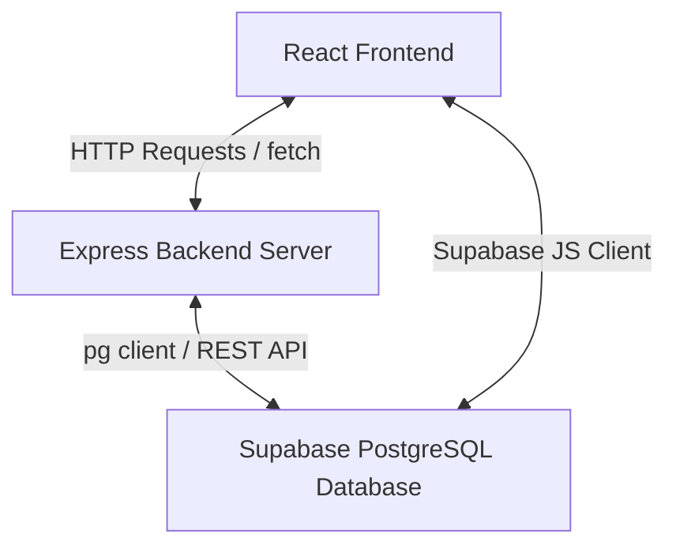

# Integration Test Plan
**Project**: Corporate Bulk Rental Portal  
**Role**: Student 3 – Testing & Deployment  
**Author**: V. Sasidhar Reddy  
**Date**: June 18, 2026

---

## 1. Introduction
This document defines the integration testing strategy to validate end-to-end data flow and communication between:
1. **Frontend**: React (Vite) User Interface.
2. **Backend**: Node.js & Express REST APIs.
3. **Database**: Supabase PostgreSQL database instances.
4. **Operations / Logic**: Rule-based pricing & status transitions.

---

## 2. Test Architecture & Integration Points

### Integration Interfaces:
* **Interface INT-01**: React client form (`RequestForm.jsx`) POSTing new bulk requests to the Express backend `/api/hello` or Supabase REST endpoint.
* **Interface INT-02**: Admin/Client dashboard loading tables via GET requests.
* **Interface INT-03**: Role authentication checks using Supabase JWT tokens to restrict protected pages.
* **Interface INT-04**: Rule-based calculation of quotation pricing based on quantity, daily rate, and rental duration.

---

## 3. Integration Test Scenarios

### INT-SC-01: End-to-End Bulk Request Creation
* **Objective**: Verify that submitting the Multi-Step Enquiry Form writes correct data into the database.
* **Process**:
  1. Frontend submits request payload (Company Name, Device Types, Quantities, Dates).
  2. Backend validates that quantities are positive integers and dates are logical.
  3. Database inserts record in the `rental_requests` and `device_requests` tables.
* **Expected Result**: HTTP 201 Created response; database entry shows status as 'Under Review'.

### INT-SC-02: Role Guard and Route Protection
* **Objective**: Verify that unauthenticated or unauthorized users are blocked from Admin endpoints.
* **Process**:
  1. Attempt to fetch admin request list without a valid JWT token.
  2. Attempt to fetch admin total revenue using a client role token.
* **Expected Result**: Backend returns HTTP 401 Unauthorized or HTTP 403 Forbidden.

### INT-SC-03: Real-time Quotation Calculations
* **Objective**: Verify that quotation values accurately reflect the sum of device allocations.
* **Process**:
  1. Admin submits a quotation total of `5` laptops for `10` days at a daily rate of `500`.
  2. Subtotal calculation: `5 * 10 * 500 = 25,000`.
* **Expected Result**: The frontend dashboard displays a quotation total of `25,000` and transitions status to 'Quoted'.

### INT-SC-04: Status History Log Cascade
* **Objective**: Verify database trigger or backend service inserts status history logs.
* **Process**:
  1. Admin transitions order from 'Quoted' to 'Allocated'.
  2. Query the `status_history` table for the corresponding `request_id`.
* **Expected Result**: An entry in `status_history` is automatically created containing the previous status, new status, and the admin operator timestamp.

---

## 4. Defect Reporting and Escalation Flow
All integration defects must be logged in `tests/bug_reports.md` and flagged with a corresponding Priority level (Critical, High, Medium, Low). The assigned owner (Student 1 for Frontend, Student 2 for Backend) must resolve the defect prior to moving from Integration testing to full production deployment.
